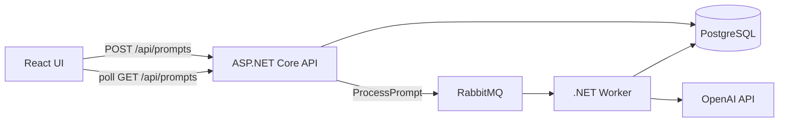

# Prompt Processor

A small full-stack system for submitting prompts and tracking their processing state.
The HTTP API stores every job in PostgreSQL, RabbitMQ carries processing commands,
and a separate worker calls the language model. The React UI follows progress with
simple polling.

## Architecture



The API and worker are separate processes but share one database. For this exercise,
that keeps status reads straightforward without pretending the solution needs a
larger microservice topology.

## Run locally

Requirements: Docker Desktop and an OpenAI API key.

```bash
cp .env.example .env
# add OPENAI_API_KEY to .env
docker compose up --build
```

Open:

- UI: <http://localhost:3000>
- OpenAPI document: <http://localhost:8080/openapi/v1.json>
- RabbitMQ management: <http://localhost:15672> (`prompts` / `prompts`)

The published ports listen on localhost only. PostgreSQL and RabbitMQ keep their
data in named Docker volumes, so restarting the stack does not discard queued or
stored jobs. Run `docker compose down --volumes` when you want a clean database and
queue.

For an offline UI or queue demo, set `LLM_PROVIDER=Fake` and
`DOTNET_ENVIRONMENT=Demo`. The real OpenAI provider is the default and the fake
provider cannot be enabled accidentally in a production environment.

## API

Submit up to 20 prompts in one request:

```http
POST /api/prompts
Content-Type: application/json

{
  "prompts": [
    { "content": "Explain the outbox pattern in two paragraphs." },
    { "content": "Compare polling and WebSockets for a small dashboard." }
  ]
}
```

The API responds with `202 Accepted`. Each returned job moves through:

```text
Pending -> Processing -> Completed
                      \-> Failed
```

Retrieve all jobs, newest first:

```http
GET /api/prompts
```

## Development

To run the services directly during development, start PostgreSQL and RabbitMQ
first:

```bash
docker compose up -d postgres rabbitmq
```

Then run the API, worker, and UI in separate terminals. Development uses the
explicit fake model, so it does not consume API credits:

```bash
dotnet run --project backend/src/PromptProcessor.Api
dotnet run --project backend/src/PromptProcessor.Worker
cd frontend && npm ci && npm run dev
```

The API listens at `http://localhost:8080`; Vite proxies `/api` requests to it.

Checks:

Backend:

```bash
dotnet restore PromptProcessor.sln
dotnet build PromptProcessor.sln
dotnet test PromptProcessor.sln
```

Frontend:

```bash
cd frontend
npm ci
npm run dev
npm test
npm run lint
```

Full Compose smoke test (uses the fake model and never consumes API credits):

```bash
bash scripts/smoke-test.sh
```

The script requires Bash, curl, and jq; these are already available on the Ubuntu CI
runner. It starts the complete stack, submits a two-prompt batch, waits for both jobs
to complete, and always removes its containers and test volumes.

Set `VITE_API_URL` only when the API runs at a different address.

## Project structure

```text
backend/src/
  PromptProcessor.Domain/          Job state and message contract
  PromptProcessor.Infrastructure/  EF Core and shared infrastructure
  PromptProcessor.Api/             HTTP API and message publisher
  PromptProcessor.Worker/          RabbitMQ consumer and LLM client
backend/tests/
frontend/
```

## Design notes

- A queue message contains only the job ID. The prompt remains in PostgreSQL and is
  not duplicated in RabbitMQ.
- MassTransit's transactional outbox stores each job and its outgoing command in one
  PostgreSQL transaction. Broker downtime can delay delivery, but cannot strand a
  job between the database and RabbitMQ.
- The domain object owns valid status transitions instead of exposing public setters.
- A redelivered message is ignored after a job reaches a terminal state, and
  optimistic concurrency prevents two workers from claiming the same pending job.
- The worker has bounded concurrency so a burst of submitted prompts does not create
  an unbounded number of model calls.
- The OpenAI client retries a small number of transient requests inside the job's
  overall timeout; exhausted or permanent failures move the job to `Failed`.
- Validation limits both batch size and prompt length. API keys stay in worker
  configuration and are never returned to the browser.
- Polling stops when no job is pending or processing.
- PostgreSQL and RabbitMQ use named volumes; exposed development ports bind only to
  the local machine.

## Possible next steps

- pagination and tenant isolation;
- metrics for queue time and processing time;
- stale-processing recovery and provider-level idempotency;
- authentication and per-user rate limits for a public deployment.

## License

[MIT](LICENSE)
